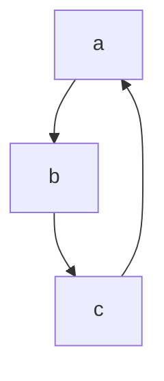

+++
title = "Hugo主题改造"
description = "Hugo主题改造"
date = "2022-03-20"
author = "Antonio.DC"
tags = [
    "开源小项目",
]
categories = [
    "Hugo",
]

series=["Hugo"]

toc = true
mermaid = true

+++


# Hugo-Next主题改造

**【摘要】** 边学边改造，慢慢的走下去

## 一、 toc目录打开

在文档开头输入toc=true，hugo将其封装为.  下面进行测试

## 这是一个二级标题

### 这是一个三级标题

#### 这是一个四级标题

##### 这是一个五级标题

###### 这是一个六级标题

正文部分是这样的


## 二、 支持Mermaid图表

这是一个序列图

```sequence
Title:abc
a->b:start
b->c:test1
c-->b:test2
b-->a:end

```




不同于Typora中的mermaid格式，其格式如下


graph TB
a-->b
b-->c
c-->a


----------------------------


flowchart LR
a-->b & c-->d



【另外Makedown的常用语法】 

这是一个**粗体**字

这是一个*斜体*字

这是一个`引用`

代码高亮显示

```go
int a = b
```

```c++
int a = b
```

```java
int a = b
```

```c
int a = b
```

```c
int hash(char * str, int length) { // hash function
    int hash = 0;
    for (int i = 0; i < length; i++) {
        hash = ((hash + str[i]) * 31) % MAX_ID; // maximum of ID?
    }
    return hash;
}
```


## 三、支持多媒体改造

### 1. B站视频外连接

```

```




### 2. 网易云外连接

```

```



### 3. 支持youku外连接

```

```



## 四、添加addThis分享

https://www.addthis.com/ addThis官网

## 五、添加友链页面

https://antonio-dc.gitee.io/friend.html

## 六、 添加专栏页面

https://antonio-dc.gitee.io/series/

## 七、取消访问人数、取消打赏、取消观看时间等功能

## 八、增加公告栏功能